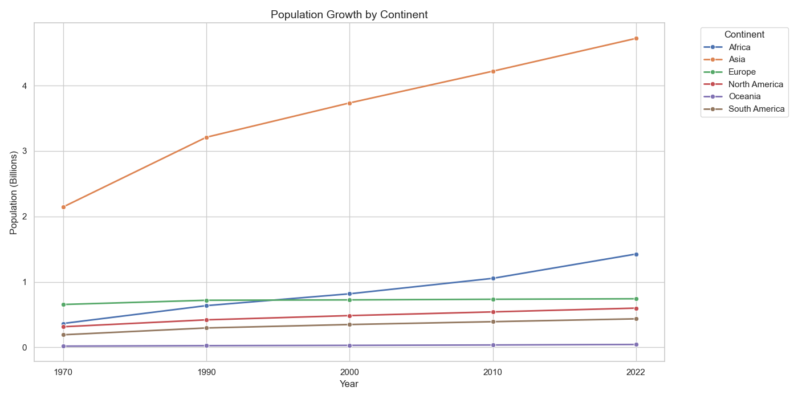
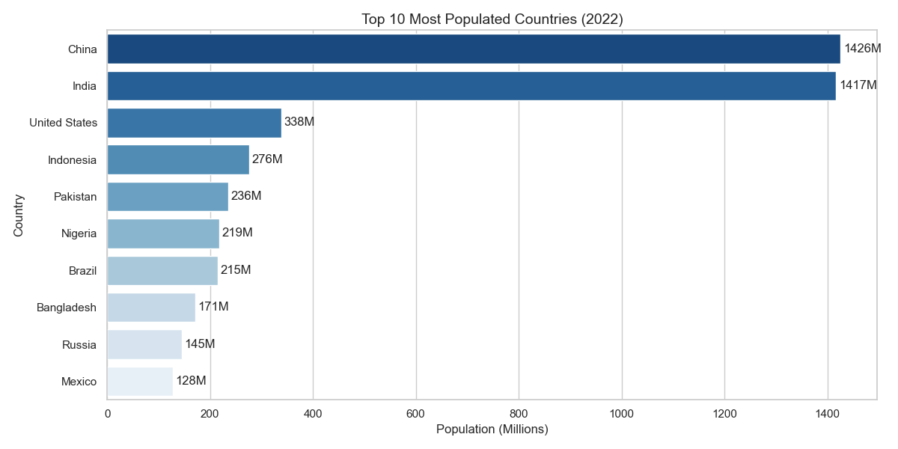
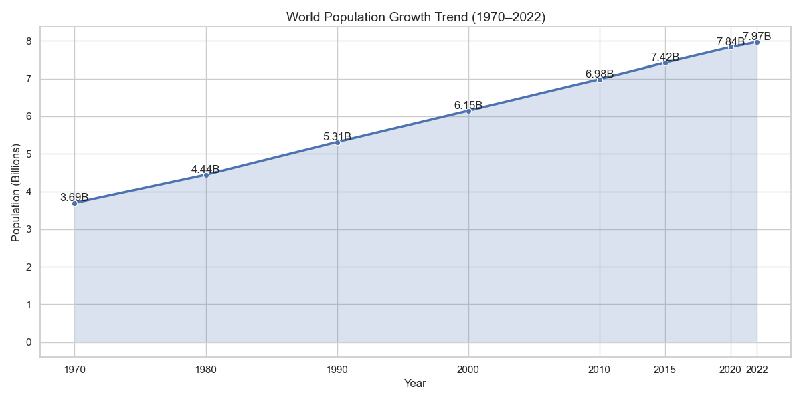
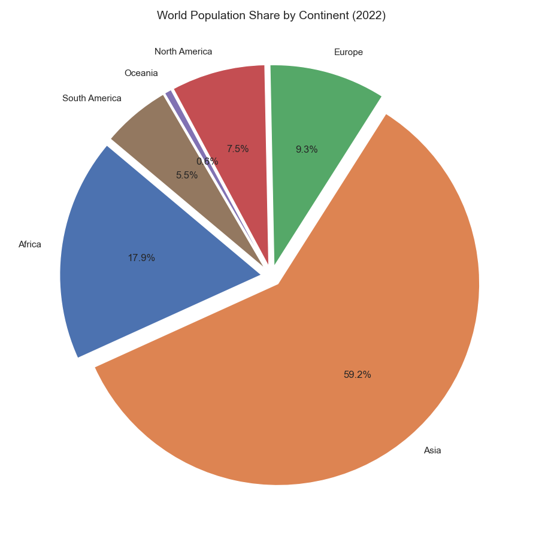
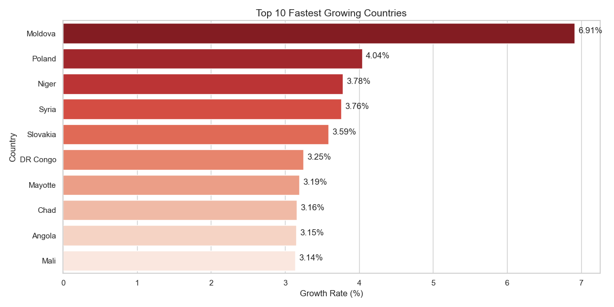
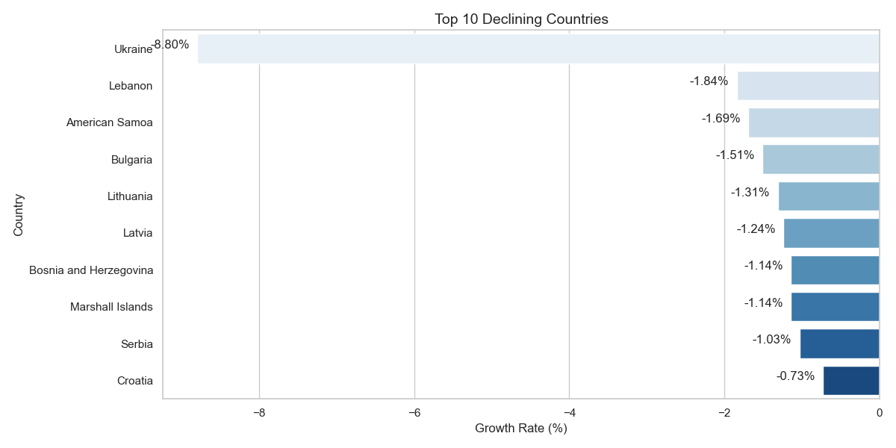
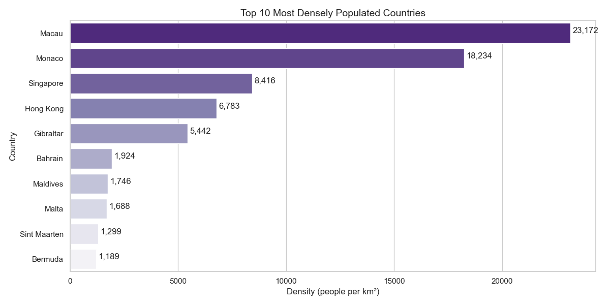
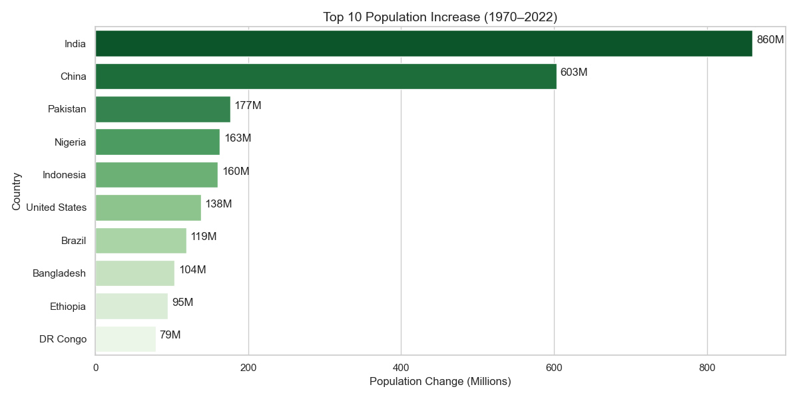
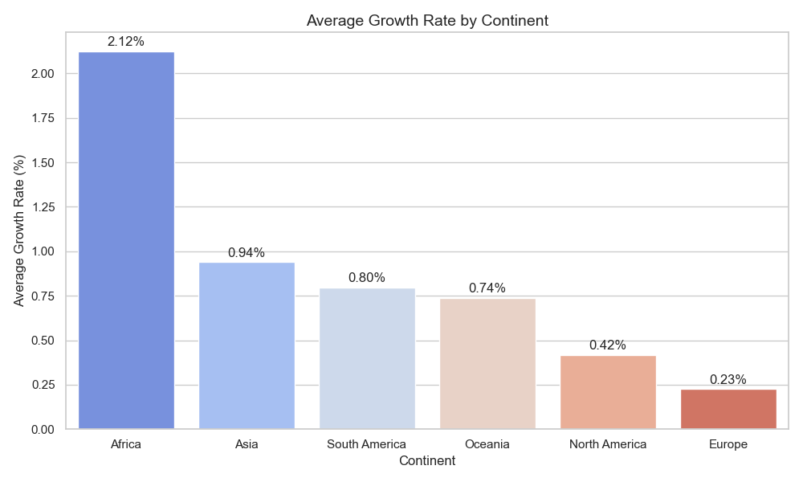

# Urban Population Analysis

<p align="center">
  
</p>

<p align="center">
  <b>Data Analysis • Exploratory Data Analysis • Population Trends • Data Visualization</b>
</p>

---

# Project Overview

This project performs a comprehensive analysis of global population trends using Python-based data analytics techniques. The workflow includes data cleaning, exploratory data analysis (EDA), statistical insights, and advanced visualizations to understand population growth patterns, continent-wise demographic distributions, density trends, and urbanization insights.

The project demonstrates practical implementation of:
- Data Cleaning & Preprocessing
- Exploratory Data Analysis (EDA)
- Statistical Analysis
- Data Visualization
- Population Trend Analysis
- Python Automation

---

# Tech Stack

| Technology | Purpose |
|------------|---------|
| Python | Core Programming |
| Pandas | Data Cleaning & Analysis |
| Matplotlib | Data Visualization |
| Seaborn | Statistical Visualization |

---

# Dataset Information

The dataset contains worldwide population statistics including:
- Country-wise population data
- Population growth rates
- Population density
- Area information
- Continent-wise distributions
- Historical population data from 1970 to 2022

---

# Project Workflow

```text
Raw Dataset
     ↓
Data Cleaning & Preprocessing
     ↓
Exploratory Data Analysis
     ↓
Population Trend Analysis
     ↓
Advanced Visualizations
     ↓
Insights & Conclusions
```

---

# Project Structure

```bash
urban-population-analysis/
│
├── clean.py
├── eda.py
├── visualize.py
│
├── world_population.csv
│
├── data/
│   └── cleaned_population.csv
│
├── charts/
│   ├── chart1_top10_populated.png
│   ├── chart2_world_population_trend.png
│   ├── chart3_continent_pie.png
│   ├── chart4_fastest_growing.png
│   ├── chart5_declining_countries.png
│   ├── chart6_continent_growth.png
│   ├── chart7_density.png
│   ├── chart8_population_change.png
│   └── chart9_continent_growth_rate.png
│
├── README.md
├── requirements.txt
└── .gitignore
```

---

# Features

- Cleans and preprocesses global population datasets
- Performs continent-wise and country-wise analysis
- Calculates population growth percentages
- Identifies fastest growing and declining countries
- Analyzes density and demographic distributions
- Generates professional visualizations
- Provides analytical insights using EDA techniques

---

# Data Cleaning & Preprocessing

The `clean.py` module performs:
- Column renaming
- Null value checking
- Growth rate calculations
- Population change analysis
- Percentage growth computation
- Data export to cleaned CSV format

### Output File

```bash
data/cleaned_population.csv
```

---

# Exploratory Data Analysis (EDA)

The `eda.py` module analyzes:
- World population statistics
- Top populated countries
- Population distribution by continent
- Fastest growing countries
- Declining population countries
- Population density trends
- Population growth by decade
- Average continent growth rates

---

# Data Visualization

The `visualize.py` script generates advanced visual insights using Matplotlib and Seaborn.

---

## 1. Top 10 Most Populated Countries

<p align="center">
  
</p>

Visualization of the countries with the highest population in 2022.

---

## 2. World Population Growth Trend

<p align="center">
  
</p>

Shows global population growth from 1970 to 2022.

---

## 3. Population Share by Continent

<p align="center">
  
</p>

Pie chart representing continent-wise population distribution.

---

## 4. Fastest Growing Countries

<p align="center">
  
</p>

Displays countries with the highest population growth rates.

---

## 5. Declining Countries

<p align="center">
  
</p>

Highlights countries experiencing low or negative population growth.

---

## 6. Population Growth by Continent

<p align="center">
  
</p>

Trend analysis of continent-wise population growth over decades.

---

## 7. Population Density Analysis

<p align="center">
  
</p>

Top countries with the highest population density.

---

## 8. Population Increase Analysis

<p align="center">
  
</p>

Countries with the largest population increase between 1970 and 2022.

---

## 9. Average Growth Rate by Continent

<p align="center">
  
</p>

Average population growth comparison across continents.

---

# Key Insights

- Asia contributes the largest share of world population.
- Significant global population growth occurred between 1970 and 2022.
- Some countries show declining or slow population growth trends.
- Population density varies drastically across nations.
- Africa demonstrates strong population growth patterns.

---

# Installation

Clone the repository:

```bash
git clone https://github.com/your-username/urban-population-analysis.git
```

Move into the project directory:

```bash
cd urban-population-analysis
```

Install required libraries:

```bash
pip install -r requirements.txt
```

---

# Requirements

Create a `requirements.txt` file with:

```txt
pandas
matplotlib
seaborn
```

---

# How to Run

## Step 1 : Run Data Cleaning

```bash
python clean.py
```

## Step 2 : Run Exploratory Data Analysis

```bash
python eda.py
```

## Step 3 : Generate Visualizations

```bash
python visualize.py
```

---

# Future Enhancements

- Interactive dashboards using Streamlit
- Machine Learning based population forecasting
- Real-time demographic data integration
- Geospatial visualization using maps
- Power BI dashboard integration

---

# Learning Outcomes

This project helped in gaining practical experience in:
- Data Cleaning
- Exploratory Data Analysis
- Population Trend Analysis
- Statistical Visualization
- Python Automation
- Data Analytics Workflow

---

# Author

## Karthik J

AIML Student at Vidyavardhaka College of Engineering, Mysore  
Python Developer | Data Analytics | Visualization Enthusiast

---

# License

This project is developed for educational and learning purposes.
